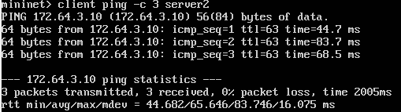
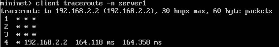

#### Team member:  
Yuanqian(Richard) Fang    
Building the ARP cache and produce the test case

Dezhi(Geralt) Ren    
Send ICMP message and arp request/reply and writing the readme

Haowen(Anson) Rui    
Perform Sanity check and forward ip(TCP/UDP, icmp) and arp packets and debugging

### ARP part

For each request in the cache, handle it
```c
 void sr_arpcache_sweepreqs(struct sr_instance *sr)  
```
Handle each arp request
```c
void sr_handle_arprequest(struct sr_instance *sr, struct sr_arpreq *request)
```
Sent if five ARP requests were sent to the next-hop IP without a response
```c
void sr_send_icmp(struct sr_instance *sr, struct sr_packet *packet)
```
An ARP request should be sent to a target IP address about once every second until a reply comes in
```c
void sr_send_arpreq(struct sr_instance *sr, struct sr_arpreq *request)
```


### IP part 

Firstly, perform Sanity check
```c
int pass_sanity_check(uint8_t *packet, unsigned int len)
```

Then, based on ethertype, call each handling function
```c
void sr_handlepacket(struct sr_instance* , uint8_t * , unsigned int , char* );
```
Handle ip packet if pass sanity check
```c
void sr_handle_ip_packet(struct sr_instance *sr,
                         uint8_t *packet/* lent */,
                         unsigned int len,
                         char *interface/* lent */)
```
Handle arp packet if pass sanity check
```c
void sr_handle_arp_packet(struct sr_instance *sr,
                          uint8_t *packet/* lent */,
                          unsigned int len,
                          char *interface/* lent */)
```
Find the longest prefix match if address is not stored in the router
```c
struct sr_rt *find_longest_prefix_match(struct sr_instance *sr, uint32_t dest_addr)
```

Use helper functions to build ethernet, ip, icmp header and
send icmp message with the specific type and code
```c
void send_ICMP_msg(struct sr_instance *sr, uint8_t *packet,
unsigned int len, char *interface, uint8_t type, uint8_t code, struct sr_if *eface, struct sr_if *ipface);
void build_ether_header(sr_ethernet_hdr_t *icmp_msg_eth, uint8_t *dhost, uint8_t *shost, uint16_t type);
void build_ip_header(sr_ip_hdr_t *icmp_msg_ip, uint16_t ip_len, uint32_t src, uint32_t dst, uint8_t ip_p);
void build_icmp_type3_header(sr_icmp_t3_hdr_t *icmp_msg_icmp, uint8_t type, uint8_t code, uint8_t *data);
void build_icmp_header(sr_icmp_hdr_t *icmp_msg_icmp, uint8_t type, uint8_t code, int len);
void build_arp_header(sr_arp_hdr_t *arp_header, struct sr_if* interface, sr_arp_hdr_t *arp_hdr, unsigned short type);
```

### Test result 
#### Pinging from the client to any of the router’s interfaces
  

  

  
#### Tracerouting from the client to any of the router’s interfaces


#### Pinging from the client to any of the app servers




#### Tracerouting from the client to any of the app servers



#### Downloading a file using HTTP from one of the app servers


#### Destination net unreachable (type 3, code 0)


#### Destination host unreachable (type 3, code 1)

